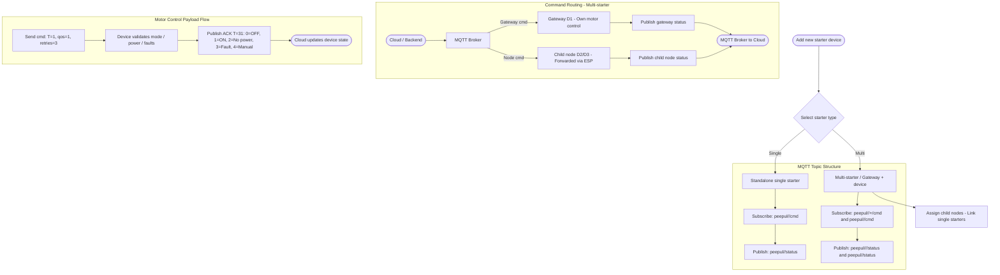

# Multi-Motor Starter System — Feature Requirements & Implementation Scope

**Document type:** Feature requirements for Claude Code  
**Scope:** Multi-starter device onboarding, MQTT topic routing, UI changes  
**References:** Topology diagrams (PA_Topology_drawio), MQTT payload spec (Multi_Motor_Starter_Communication_Payload.pdf)

---

## System Flow Diagram



> **Rendering note:** Mermaid renders automatically in GitHub, GitLab, Notion, Obsidian, and VS Code (with Markdown Preview Mermaid Support extension).

---

## 1. Background & Context

The system currently supports a single type of starter device. This feature introduces a second type — the **multi-starter** — which acts simultaneously as a motor starter and as a gateway for other single starter devices connected to it via ESP communication.

The key distinction is the MQTT topic structure: a standalone single starter uses flat topics scoped to its own device ID, whereas the multi-starter gateway uses a two-level hierarchy where child node commands are routed through the gateway ID.

---

## 2. Device Types

### 2.1 Standalone single starter
- Controls 1–2 motors directly.
- Has its own GSM module.
- MQTT topics scoped entirely to its own Device ID.
- No awareness of other devices.

### 2.2 Multi-starter (gateway + device)
- Acts as its own motor starter (Device 1 / D1M1 in topology).
- Also acts as MQTT gateway for linked child nodes.
- Communicates with child nodes over ESP (peer-to-peer local link).
- Subscribes to wildcard topic to receive commands for all children.
- Child nodes (single starters) communicate through the gateway — they do not publish independently to the cloud.

---

## 3. Data Model Changes

The following additions are required to the `Device` entity:

| Field | Type | Description |
|---|---|---|
| `type` | `enum: SINGLE \| MULTI` | Starter type selected during onboarding |
| `gatewayId` | `string \| null` | ID of the parent gateway (populated on child nodes only) |
| `childNodeIds` | `string[]` | List of child device IDs linked under this gateway (multi only) |
| `isChildNode` | `boolean` | Derived: true if `gatewayId` is not null |

> `childNodeIds` can be implemented as a junction table if the DB schema is relational.

---

## 4. MQTT Topic Structure

The routing logic must branch based on the device's type and role:

| Device state | Subscribe topic(s) | Publish topic |
|---|---|---|
| Standalone single starter | `peepul/<DeviceID>/cmd` | `peepul/<DeviceID>/status` |
| Multi-starter (gateway own motor) | `peepul/<GwID>/cmd` | `peepul/<GwID>/status` |
| Multi-starter (all children, wildcard) | `peepul/<GwID>/+/cmd` | — (cloud listens) |
| Child node command (from cloud) | — | `peepul/<GwID>/<NodeID>/cmd` |
| Child node status (to cloud) | `peepul/<GwID>/<NodeID>/status` | `peepul/<GwID>/<NodeID>/status` |

> **Important:** When the app sends a command to a child node, it must use the *gateway's* ID in the topic, not the child's own device ID. This routing must be transparent to the user.

---

## 5. Commands & ACK Payloads

All existing command types from the standalone protocol apply to child nodes via the gateway topic hierarchy. No new payload formats are introduced.

| Command | T (cmd) | T (ACK) | QoS | Retries | Gap |
|---|---|---|---|---|---|
| Motor control (ON/OFF) | 1 | 31 | 1 | 3 | 3s, then 5s |
| Mode change (Manual/Auto) | 2 | 32 | 1 | 3 | 3s, then 5s |
| Live data request | 5 | 35 | 1 | 2 | 10s |
| User config request | 6 | 36 | 1 | 2 | 10s |
| Admin config request | 13 | 44 | 1 | 2 | 10s |
| Device calibration | 3 (TBC) | 34 | 2 | 2 | 10s |
| Device info request | 10 | 39 | 1 | 2 | 10s |
| Power info request | 8 | 34* | 1 | — | — |

> **⚠ Discrepancy:** `T=34` appears in the embedded spec for both Calibration ACK and Power Info ACK. Confirm the correct T value for Power Info ACK with the embedded team before implementation.

---

## 6. Motor Control ACK — Status Codes (T=31)

The app must handle all `D` values returned in the motor control ACK:

| D value | Constant | Description | UI action |
|---|---|---|---|
| 0 | STATUS_OFF | Motor successfully turned OFF | Show OFF state |
| 1 | STATUS_ON | Motor successfully turned ON | Show ON state |
| 2 | STATUS_POWER_NOT_PRESENT | Cannot turn ON/OFF — power absent | Show error toast |
| 3 | STATUS_FAULT_BLOCKED | Active fault(s) blocking operation | Show fault details |
| 4 | STATUS_INVALID_CONTROL_MODE_CHANGE | Ignored — device in manual mode | Show mode warning |
| 5 | STATUS_INVALID_REQUEST | Malformed request or motor not found | Show error toast |
| 6 | STATUS_ALREADY_ON | Motor already ON | Sync state, no error |
| 7 | STATUS_ALREADY_OFF | Motor already OFF | Sync state, no error |
| 8 | FEATURE_NOT_ENABLED | Feature disabled on this device | Show info toast |

---

## 7. Onboarding Flow

### 7.1 Step 1 — Starter type selection
Immediately after the user enters the device serial number and it is validated, present a screen with two options:
- **Single starter** — controls its own motors only, standalone MQTT topics.
- **Multi-starter** — acts as a gateway and can have child nodes linked under it.

### 7.2 Step 2 (multi-starter only) — Node assignment
After selecting multi-starter, show a node assignment screen:
- Search bar to find existing unassigned single starter devices by serial or name.
- Selectable list — user picks which single starters to link as child nodes.
- Selected nodes are saved with `gatewayId` set to this device's ID.
- Node assignment is optional at onboarding time — it can be done later from device settings.

### 7.3 Step 3 — Confirmation
Show a summary screen listing the gateway device and its linked child nodes. User confirms. System registers the multi-starter type and node associations.

---

## 8. UI Screen Changes

### 8.1 Device list screen
- Multi-starter devices should have a visual badge/indicator (e.g. "Gateway") to distinguish from standalone.
- Child nodes that are linked to a gateway should **not** appear as top-level items in the device list — they should only appear under their gateway's detail view.

### 8.2 Device detail screen — multi-starter
- Add a "Nodes" tab (or section) listing all linked child nodes.
- Each child node row shows: name/ID, motor state (ON/OFF/fault), last seen timestamp.
- Tapping a child node opens its individual motor control screen.

### 8.3 Motor control screen — child node
- The ON/OFF control UI is identical to a standalone device.
- Under the hood, the command is published to `peepul/<GwID>/<NodeID>/cmd` — this routing is invisible to the user.
- Status is subscribed from `peepul/<GwID>/<NodeID>/status`.

### 8.4 Node management (settings)
- From a multi-starter's settings, the user can add or remove child nodes at any time.
- Removing a child node clears its `gatewayId` and reverts it to standalone mode.

---

## 9. Edge Cases & Rules

| Scenario | Expected behaviour |
|---|---|
| User tries to add a child-linked single starter as standalone | Block — device is already linked to a gateway. Show which gateway. |
| Gateway device is deleted | Unlink all child nodes (clear their `gatewayId`). Do NOT delete them. They revert to standalone. |
| Child node goes offline | Show offline state on its row in the gateway's Nodes tab. Gateway stays operational. |
| Live data aggregation for a gateway | Poll live data for gateway's own motor AND each child node. Surface per-node status in the Nodes tab. |
| Group ID in live data payload (G01, G02...) | Map group IDs to NodeIDs. Store the mapping at onboarding/assignment time. |
| Same device added as both single and child | Prevent duplicate registration. Validate at onboarding. |

---

## 10. Out of Scope (Confirm with Team)

- FOTA operations (T=14,15,16,17) — not scoped for this feature unless explicitly required.
- Quectel file add/delete (T=11,12) — not scoped.
- The `+` wildcard subscription is for the gateway firmware. Confirm if the cloud backend MQTT listener needs to mirror this.
- SMS/IVRS features — `auth_num`, `sms_pswd` fields are in calibration payload but out of scope for this UI feature.

---

## 11. Implementation Notes for Claude Code

### 11.1 MQTT service layer

Create a topic resolver utility. Given a device object, it should return the correct subscribe and publish topics:

```javascript
function resolveTopics(device) {
  if (device.type === 'SINGLE' && !device.gatewayId) {
    // Standalone single starter
    return {
      sub: `peepul/${device.id}/cmd`,
      pub: `peepul/${device.id}/status`
    };
  }
  if (device.type === 'MULTI') {
    // Gateway: own motor + wildcard for children
    return {
      sub:  [`peepul/${device.id}/cmd`, `peepul/${device.id}/+/cmd`],
      pub:   `peepul/${device.id}/status`
    };
  }
  if (device.gatewayId) {
    // Child node under a gateway
    return {
      sub: `peepul/${device.gatewayId}/${device.id}/status`,
      pub: `peepul/${device.gatewayId}/${device.id}/cmd`
    };
  }
}
```

### 11.2 Command dispatch

The `sendCommand` function must accept a device and look up its gateway context before publishing:

```javascript
async function sendMotorCommand(device, motorOn) {
  const topic = device.gatewayId
    ? `peepul/${device.gatewayId}/${device.id}/cmd`
    : `peepul/${device.id}/cmd`;

  const payload = { T: 1, S: nextSeq(), D: motorOn ? 1 : 0 };
  await mqttPublish(topic, payload, { qos: 1, retain: false });
  // Handle retries: max 3, gaps 3s then 5s
}
```

### 11.3 Status listener

When subscribing to a device's status topic, use the resolved topic from the resolver above. For the gateway device itself, also aggregate child node statuses by subscribing to `peepul/<GwID>/+/status`.

---

*End of requirements document.*
